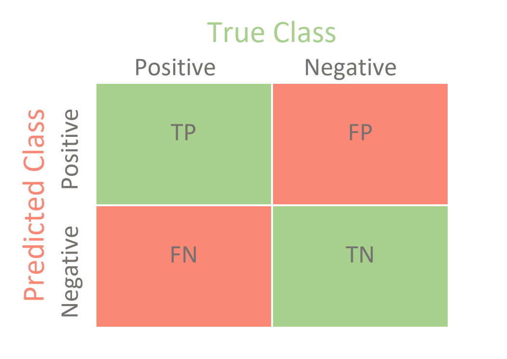
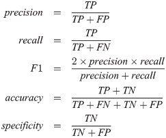

# Metrics

## Confusion Matrix 

The confusion matrix logs the hits and misses of a machine-learning model. The confusion matrix displays the distribution of records in terms of predicted and actual results. In a tabular form, the matrix show essential values to understand the model performance, such as false positives, false negatives, true positives, and true negatives.

  

- **True Positives**: correct classification of the positive class;
- **True Negatives**: Correct classification of the negative class;
- **False Positives (Type I Error)**: error in which the model predicted the Positive class when the real value was negative class;
- **False Negatives (Type II Error)**: error in which the model predicted the Negative class when the real value was the positive class;

## Evaluation metrics

- **Accuracy**: indicates an overall performance of the model. Takes into account how well the model got it right.
- **Recall**: the ability of a classification model to identify all data points in a relevant class.
- **Precision**: the ability of a classification model to return only the data points in a class.
- **F1 score**: a single metric that combines recall and precision using the harmonic mean.

